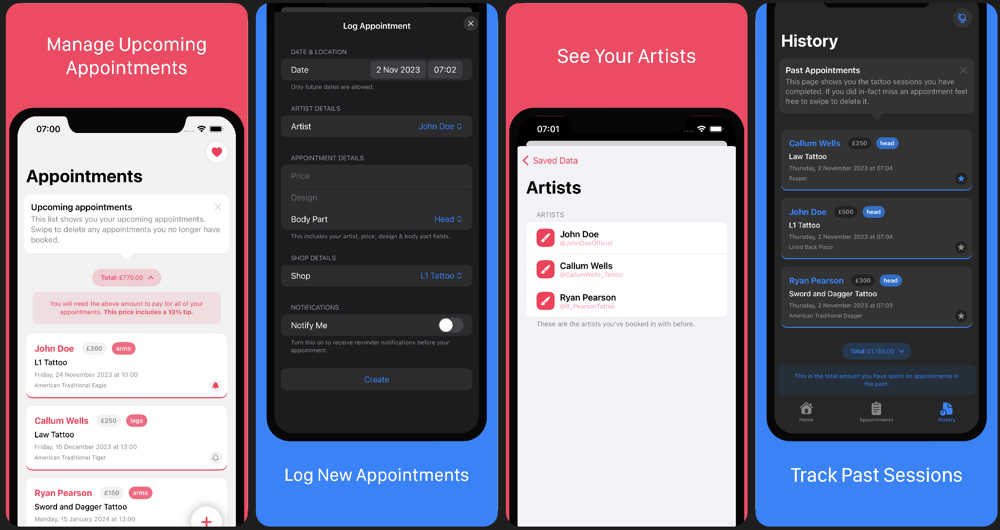

# TattooJournal [WIP]

This repository contains the Swift project for the `TattooJournal` app. This app is written using SwiftUI and contains the latest features from Swift and iOS. This app aims to be released onto the app store for iPad/iOS once it's ready. It's actively being worked on and pushed to this repository when there's new updates.

## Main Tech Used
* Swift Data
* iOS 17 SwiftUI
* CloudKit (Still to be added)
* WidgetKit (Still to be added)
* MapKit
* TipKit

* I'm also currently exploring using TCA to handle state within the app instead of using Swift Data

## Current Screenshots

